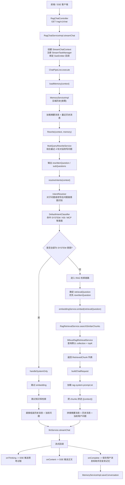

# RagTest

[](https://adoptium.net/)
[](https://spring.io/projects/spring-boot)
[](https://spring.io/projects/spring-ai)
[](https://react.dev/)
[](https://www.typescriptlang.org/)
[](https://vitejs.dev/)
[](LICENSE)

> 一个围绕 RAG 问答、知识库管理、意图识别、MCP 工具接入和流式对话构建的多模块实验项目。

[English Documentation](./README_EN.md)

## 目录

- [快速开始](#快速开始)
- [项目结构](#项目结构)
- [技术栈](#技术栈)
- [核心流程](#核心流程)
- [配置概览](#配置概览)
- [API 接口](#api-接口)
- [前端开发](#前端开发)
- [演进路线](#演进路线)
- [推荐阅读](#推荐阅读)

## 快速开始

### 环境要求

- **JDK** 17+
- **Maven** 3.8+
- **Node.js** 20+（前端）
- **MySQL** 8.0+
- **Redis** 7.0+
- **Milvus** 2.4+（向量数据库）
- **RocketMQ** 5.x（消息队列）
- **MinIO** / S3 兼容存储（文件存储）

### 后端启动

```bash
# 1. 克隆仓库
git clone <repo-url>
cd RagTest

# 2. 确保 MySQL、Redis、Milvus、RocketMQ、MinIO 已启动

# 3. 修改数据库和中间件连接信息
# 编辑 rag-bootstrap/src/main/resources/application.yaml
# 主要配置：datasource、redis、milvus、rocketmq、rustfs(s3)

# 4. 编译并启动
mvn clean package -DskipTests
cd rag-bootstrap
mvn spring-boot:run
```

后端启动后，API 服务运行在 `http://localhost:8080`。

### 前端启动

```bash
cd rag-web

# 安装依赖
npm install

# 开发模式启动（默认监听 0.0.0.0:5173）
npm run dev

# 构建生产版本
npm run build
```

## 项目结构

```
RagTest/
├── rag-bootstrap/    # 主业务模块：问答链路、知识库、记忆、意图识别、API
├── infra/            # 基础设施：LLM、Embedding、Rerank、模型路由、熔断
├── framework/        # 通用框架：异常处理、Web 返回体、基础设施封装
├── rag-mcp/          # MCP 服务：工具定义与 SSE 接入
├── rag-web/          # 前端：React + TypeScript + Vite
└── docs/             # 项目文档
```

### 模块职责

| 模块 | 说明 |
|------|------|
| `rag-bootstrap` | 应用入口，包含 Chat 控制器、问答 Pipeline、记忆管理、意图识别、知识库检索、文件上传等核心业务 |
| `infra` | 封装大模型调用、Embedding 向量化、Rerank 重排序、多模型路由与熔断切换 |
| `framework` | 统一异常处理、标准返回体（`R<T>`）、通用工具类 |
| `rag-mcp` | 基于 Spring AI MCP 的工具服务，支持 SSE 连接与工具回调 |
| `rag-web` | 对话界面，支持流式问答、知识库管理、文件上传、MCP 配置等 |

## 技术栈

### 后端

| 领域 | 技术 |
|------|------|
| 语言 & 框架 | Java 17、Spring Boot 4.0、Spring AI 2.0 |
| 向量数据库 | Milvus |
| 关系数据库 | MySQL + MyBatis-Plus |
| 缓存 & 分布式锁 | Redis / Redisson |
| 消息队列 | RocketMQ |
| 对象存储 | MinIO / S3（AWS SDK v2） |
| 认证鉴权 | Sa-Token（Redis 集成） |
| 搜索引擎 | Elasticsearch 8.x |
| 文档解析 | Apache Tika 2.x |
| HTTP 客户端 | OkHttp 5.x |
| 工具库 | Hutool、Lombok |

### 前端

| 领域 | 技术 |
|------|------|
| 框架 | React 19 |
| 语言 | TypeScript 5.9 |
| 构建工具 | Vite 6 |
| 路由 | React Router 7 |
| 图标 | Lucide React |
| 测试 | Vitest + jsdom |

### AI 能力

- **多模型提供商**：百炼（阿里云）、硅基流动（SiliconFlow），支持按优先级自动切换
- **模型熔断**：连续失败达阈值后自动熔断，超时后半开探测
- **Chat 模型**：支持推理模式（deep thinking）的流式输出
- **Embedding**：Qwen3-Embedding-8B，4096 维向量
- **Rerank**：Qwen3-Rerank，支持 noop 降级
- **MCP 集成**：Spring AI MCP Client，SSE 协议连接

## 核心流程

当前已实现"记忆加载 → 问题改写 → 意图识别 → 知识库检索 → Prompt 组装 → 流式输出"的完整闭环。



详细说明见：[RAG 检索全流程架构文档](./docs/rag-retrieval-architecture.md)

## 配置概览

项目配置集中在 `rag-bootstrap/src/main/resources/application.yaml`，关键配置项如下：

### 数据与中间件

```yaml
# MySQL
spring.datasource.url: jdbc:mysql://127.0.0.1:3306/rag?...
# Redis
spring.data.redis.host: 127.0.0.1, port: 6379
# Milvus
rag.vector.milvus.uri: http://localhost:19530
# RocketMQ
rocketmq.name-server: 127.0.0.1:9876
# S3 / MinIO
rustfs.url: http://localhost:9000
```

### AI 提供商

项目支持多模型提供商，按优先级自动选择：

```yaml
ai.providers:
  bailian:       # 阿里云百炼
  siliconflow:   # 硅基流动
```

每个提供商可独立配置 Chat、Embedding、Rerank 端点，模型通过 `priority` 字段控制选择优先级。

### 模型熔断

```yaml
ai.selection:
  failure-threshold: 2    # 连续失败 N 次后熔断
  open-duration-ms: 30000 # 熔断 30s 后半开探测
```

## API 接口

| 方法 | 路径 | 说明 |
|------|------|------|
| `GET` | `/rag/v1/chat?question=...&chatId=...` | SSE 流式问答（主入口） |
| `POST` | `/rag/v1/knowledge/upload` | 文件上传到知识库 |
| `GET` | `/rag/v1/knowledge/list` | 知识库文件列表 |
| `GET` | `/rag/v1/chat/stop/{chatId}` | 停止对话流 |
| `GET` | `/rag/v1/chat/history/{chatId}` | 获取对话历史 |
| `GET` | `/rag/v1/chat/new` | 创建新对话 |

> 完整接口以实际运行时的 Swagger / OpenAPI 文档为准。

## 前端开发

```bash
cd rag-web

# 开发模式（带 HMR）
npm run dev

# 运行测试
npm test

# 生产构建
npm run build

# 预览构建产物
npm run preview
```

前端基于 React 19 + Vite 6，使用 React Router 7 管理路由，Lucide React 提供图标。

### 主要页面

- **对话页**：流式问答，支持思考过程展示、对话历史、停止生成
- **知识库管理**：文件上传、分块策略配置、知识库列表
- **MCP 配置**：MCP 工具管理与连接配置

## 演进路线

当前版本已完成"会话记忆 + 问题改写 + 意图识别 + 默认知识库检索 + 流式回答"闭环。以下为后续规划：

| 优先级 | 方向 | 说明 |
|--------|------|------|
| P0 | 意图驱动路由 | 意图节点动态路由到具体 `kbId / collectionName`，而非统一查默认集合 |
| P1 | MCP 执行链路 | MCP 意图识别已具备，接入工具调用到主问答编排 |
| P2 | Rerank 接入 | `infra` 已有 RerankService，接入检索与 Prompt 组装之间 |
| P3 | 多意图编排 | 支持 KB / MCP 混合场景下的多意图联合处理 |

## 推荐阅读

### 文档

- [RAG 检索全流程架构文档](./docs/rag-retrieval-architecture.md)

### 代码入口（推荐顺序）

1. `rag-bootstrap/src/main/java/org/puregxl/site/rag/controller/RagChatController.java` — SSE 问答入口
2. `rag-bootstrap/src/main/java/org/puregxl/site/rag/service/impl/RagChatServiceImpl.java` — 对话服务实现
3. `rag-bootstrap/src/main/java/org/puregxl/site/rag/pipeline/ChatPipeLine.java` — 核心 Pipeline 编排
4. `rag-bootstrap/src/main/java/org/puregxl/site/rag/service/impl/MemoryServiceImpl.java` — 记忆管理
5. `rag-bootstrap/src/main/java/org/puregxl/site/rag/core/rewrite/MutiQueryRewriteService.java` — 问题改写
6. `rag-bootstrap/src/main/java/org/puregxl/site/rag/core/intent/IntentResolver.java` — 意图解析
7. `rag-bootstrap/src/main/java/org/puregxl/site/rag/core/intent/DefaultIntentClassifier.java` — 意图分类
8. `rag-bootstrap/src/main/java/org/puregxl/site/rag/retrieval/impl/MilvusRagRetrievalService.java` — Milvus 检索
9. `rag-bootstrap/src/main/resources/prompt/rag-system-prompt.txt` — 系统 Prompt 模板

## 一句话总结

`RagTest` 已实现从"记忆 → 改写 → 意图 → 检索 → 生成"的 RAG 全链路闭环；下一步的重点是让命中的意图真正驱动知识库路由和工具调用，完成从分类到执行的最后一公里。
