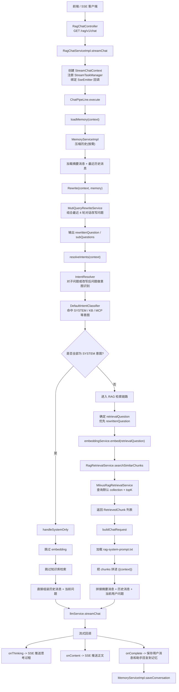

# RagTest

英文版文档见：

- [README_EN.md](./README_EN.md)

`RagTest` 是一个围绕 RAG 问答、知识库管理、意图识别、MCP 工具接入和流式对话构建的多模块实验项目。

当前仓库主要聚焦于一个已经跑通的端到端闭环，包含：

- SSE 流式问答
- 会话记忆
- 问题改写
- 意图识别
- 默认知识库检索
- 大模型流式输出

## 仓库结构

当前仓库主要包含以下模块：

- `rag-bootstrap`
  - 主业务模块
  - 包含问答链路、知识库、记忆、意图识别和 API 接口
- `infra`
  - 大模型、Embedding、Rerank、模型路由等基础能力封装
- `framework`
  - 通用约定、异常、Web 返回体和基础设施封装
- `rag-mcp`
  - MCP 服务示例与工具接入
- `rag-web`
  - 前端页面与交互演示

## 技术栈

- 后端：Java 17、Spring Boot、Spring AI
- 数据与中间件：Milvus、Redis / Redisson、MyBatis-Plus
- 前端：React、TypeScript、Vite
- 流式通信：基于 SSE 的问答输出

## 检索架构

当前项目的检索主流程已经整理成专门文档，详细说明了：

- SSE 问答入口
- 记忆加载与压缩
- 问题改写
- 意图识别
- `SYSTEM-only` 短路逻辑
- 默认知识库检索链路
- Prompt 组装与流式输出

详细文档见：

- [RAG 检索全流程架构文档](./docs/rag-retrieval-architecture.md)

## 当前检索主流程图

## 当前前端 UI

## 当前实现边界

当前仓库已经实现了“记忆 + 改写 + 意图识别 + 默认知识库检索 + 流式输出”的完整闭环，但下面两块还没有完全接入主流程：

- 还没有按命中的意图节点动态路由到具体 `kbId / collectionName`
- `MCP` 意图识别已经具备，但工具调用链路还没有进入主问答编排

## 当前还缺什么

### 1. 意图节点还没有真正驱动知识库路由

虽然意图树节点已经支持如下字段：

- `kbId`
- `collectionName`
- `mcpToolId`

但当前主检索链路里，`MilvusRagRetrievalService` 仍然使用的是全局默认配置，例如：

- 默认 `collectionName`
- 默认 `topK`

也就是说，当前还不是“按命中的意图节点路由到具体知识库”，而是“统一查默认知识库集合”。

### 2. MCP 工具执行尚未进入主问答流程

当前系统已经可以识别 `MCP` 类型意图节点，但主 `ChatPipeLine` 还没有完成以下工作：

- 根据 `mcpToolId` 选择具体工具
- 发起工具调用
- 将工具结果注入最终 Prompt

所以目前 MCP 相关能力更准确的描述是：

- 意图识别已具备
- 执行编排仍待接入

### 3. Rerank 还没有接入主流程

`infra` 模块中已经存在 `RerankService` 相关实现，但当前 RAG 主链路仍然是：

`改写 -> embedding -> Milvus TopK 检索 -> Prompt 组装 -> 大模型回答`

而不是：

`改写 -> embedding -> 检索 -> rerank -> Prompt 组装 -> 大模型回答`

## 建议阅读顺序

如果你准备继续演进这条链路，建议先阅读：

- [RAG 检索全流程架构文档](./docs/rag-retrieval-architecture.md)

推荐优先阅读的代码入口：

- `rag-bootstrap/src/main/java/org/puregxl/site/rag/controller/RagChatController.java`
- `rag-bootstrap/src/main/java/org/puregxl/site/rag/service/impl/RagChatServiceImpl.java`
- `rag-bootstrap/src/main/java/org/puregxl/site/rag/pipeline/ChatPipeLine.java`
- `rag-bootstrap/src/main/java/org/puregxl/site/rag/service/impl/MemoryServiceImpl.java`
- `rag-bootstrap/src/main/java/org/puregxl/site/rag/core/rewrite/MutiQueryRewriteService.java`
- `rag-bootstrap/src/main/java/org/puregxl/site/rag/core/intent/IntentResolver.java`
- `rag-bootstrap/src/main/java/org/puregxl/site/rag/core/intent/DefaultIntentClassifier.java`
- `rag-bootstrap/src/main/java/org/puregxl/site/rag/retrieval/impl/MilvusRagRetrievalService.java`
- `rag-bootstrap/src/main/resources/prompt/rag-system-prompt.txt`

## 建议的后续演进方向

如果后续要继续完善当前架构，比较自然的顺序是：

1. 让意图节点真正驱动知识库路由
2. 让 `MCP` 意图进入执行链路
3. 在检索与 Prompt 组装之间启用 rerank
4. 支持 KB / MCP 混合场景下的多意图编排

## 一句话总结

`RagTest` 目前已经具备“会话记忆 + 问题改写 + 意图识别 + 默认知识库检索 + 流式回答”的完整闭环；下一步的重点，是让命中的意图真正驱动知识库和工具，而不是停留在分类层。
