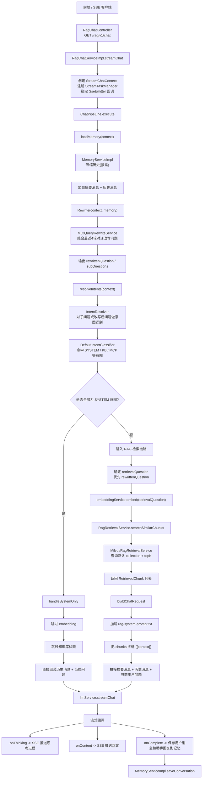
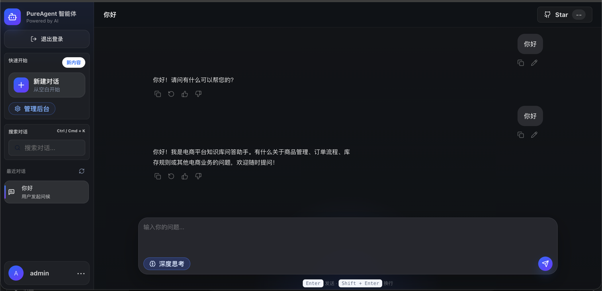

# RagTest

`RagTest` 是一个围绕 RAG 问答、知识库管理、意图识别、MCP 工具接入和流式对话构建的多模块实验项目。

当前仓库主要包含以下模块：

- `rag-bootstrap`
  - 主业务模块，包含问答链路、知识库、记忆、意图识别和 API 接口
- `infra`
  - 大模型、Embedding、Rerank 等基础能力封装
- `framework`
  - 通用约定、异常、Web 返回体和基础设施封装
- `rag-mcp`
  - MCP 服务示例与工具接入
- `rag-web`
  - 前端页面与交互演示

## 检索架构

当前项目的检索主流程已经整理成专门文档，详细说明了：

- SSE 问答入口
- 记忆加载与压缩
- 问题改写
- 意图识别
- `SYSTEM-only` 短路逻辑
- 默认知识库检索链路
- Prompt 组装与流式输出

详细文档见：

- [RAG 检索全流程架构文档](./docs/rag-retrieval-architecture.md)

## 当前检索主流程图

当前前端UI

## 当前实现边界

当前仓库已经实现了“记忆 + 改写 + 意图识别 + 默认知识库检索 + 流式输出”的完整闭环，但下面两块还没有完全接入主流程：

- 还没有按命中的意图节点动态路由到具体 `kbId / collectionName`
- `MCP` 意图识别已经具备，但工具调用链路还没有进入主问答编排

如果你准备继续演进这条链路，建议先阅读：

- [docs/rag-retrieval-architecture.md](/Users/gaoxaiolei/IdeaProjects/RagTest/docs/rag-retrieval-architecture.md)
