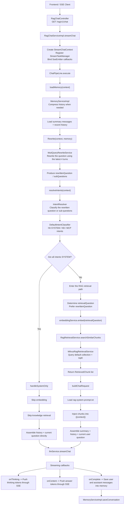

# RagTest

[](https://adoptium.net/)
[](https://spring.io/projects/spring-boot)
[](https://spring.io/projects/spring-ai)
[](https://react.dev/)
[](https://www.typescriptlang.org/)
[](https://vitejs.dev/)
[](LICENSE)

> A multi-module experimental project for building RAG-powered chat, knowledge base management, intent recognition, MCP tool integration, and streaming conversational experiences.

[中文文档](./README.md)

## Table of Contents

- [Quick Start](#quick-start)
- [Project Structure](#project-structure)
- [Tech Stack](#tech-stack)
- [Core Pipeline](#core-pipeline)
- [Configuration](#configuration)
- [API Endpoints](#api-endpoints)
- [Frontend Development](#frontend-development)
- [Roadmap](#roadmap)
- [Recommended Reading](#recommended-reading)

## Quick Start

### Prerequisites

- **JDK** 17+
- **Maven** 3.8+
- **Node.js** 20+ (frontend)
- **MySQL** 8.0+
- **Redis** 7.0+
- **Milvus** 2.4+ (vector database)
- **RocketMQ** 5.x (message queue)
- **MinIO** / S3-compatible storage (file storage)

### Backend

```bash
# 1. Clone the repository
git clone <repo-url>
cd RagTest

# 2. Ensure MySQL, Redis, Milvus, RocketMQ, and MinIO are running

# 3. Update connection settings in:
#    rag-bootstrap/src/main/resources/application.yaml
#    Key sections: datasource, redis, milvus, rocketmq, rustfs (S3)

# 4. Build and run
mvn clean package -DskipTests
cd rag-bootstrap
mvn spring-boot:run
```

The API server starts at `http://localhost:8080`.

### Frontend

```bash
cd rag-web

# Install dependencies
npm install

# Start dev server (listens on 0.0.0.0:5173)
npm run dev

# Production build
npm run build
```

## Project Structure

```
RagTest/
├── rag-bootstrap/    # Main business module: chat pipeline, KB, memory, intents, APIs
├── infra/            # Infrastructure: LLM, Embedding, Rerank, model routing, circuit breaker
├── framework/        # Shared framework: exceptions, response wrappers, utilities
├── rag-mcp/          # MCP service: tool definitions and SSE integration
├── rag-web/          # Frontend: React + TypeScript + Vite
└── docs/             # Documentation
```

### Module Overview

| Module | Description |
|--------|-------------|
| `rag-bootstrap` | Application entry point. Contains the chat controller, RAG pipeline, memory management, intent recognition, knowledge-base retrieval, and file upload. |
| `infra` | Encapsulates LLM calls, embedding, reranking, multi-model routing with circuit breaker, and provider failover. |
| `framework` | Unified exception handling, standard response envelope (`R<T>`), and common utilities. |
| `rag-mcp` | MCP tool server built on Spring AI MCP, supporting SSE connections and tool callbacks. |
| `rag-web` | Chat interface with streaming answers, knowledge-base management, file upload, and MCP configuration. |

## Tech Stack

### Backend

| Domain | Technology |
|--------|------------|
| Language & Framework | Java 17, Spring Boot 4.0, Spring AI 2.0 |
| Vector Database | Milvus |
| Relational Database | MySQL + MyBatis-Plus |
| Cache & Distributed Lock | Redis / Redisson |
| Message Queue | RocketMQ |
| Object Storage | MinIO / S3 (AWS SDK v2) |
| Authentication | Sa-Token (Redis-backed) |
| Search Engine | Elasticsearch 8.x |
| Document Parsing | Apache Tika 2.x |
| HTTP Client | OkHttp 5.x |
| Utilities | Hutool, Lombok |

### Frontend

| Domain | Technology |
|--------|------------|
| Framework | React 19 |
| Language | TypeScript 5.9 |
| Build Tool | Vite 6 |
| Routing | React Router 7 |
| Icons | Lucide React |
| Testing | Vitest + jsdom |

### AI Capabilities

- **Multi-provider**: Bailian (Alibaba Cloud) and SiliconFlow, with priority-based auto selection
- **Circuit breaker**: Auto-circuits a model after consecutive failures; half-open probe after timeout
- **Chat models**: Streaming output with optional deep-thinking (reasoning) mode
- **Embedding**: Qwen3-Embedding-8B, 4096-dimensional vectors
- **Rerank**: Qwen3-Rerank, with noop fallback for graceful degradation
- **MCP integration**: Spring AI MCP Client over SSE protocol

## Core Pipeline

The current pipeline implements a complete loop: memory loading → query rewriting → intent recognition → knowledge-base retrieval → prompt assembly → streaming output.



For an in-depth walkthrough, see: [RAG Retrieval Architecture](./docs/rag-retrieval-architecture.md)

## Configuration

All configuration is centralized in `rag-bootstrap/src/main/resources/application.yaml`. Key sections:

### Data & Middleware

```yaml
# MySQL
spring.datasource.url: jdbc:mysql://127.0.0.1:3306/rag?...
# Redis
spring.data.redis.host: 127.0.0.1, port: 6379
# Milvus
rag.vector.milvus.uri: http://localhost:19530
# RocketMQ
rocketmq.name-server: 127.0.0.1:9876
# S3 / MinIO
rustfs.url: http://localhost:9000
```

### AI Providers

Multiple model providers with priority-based selection:

```yaml
ai.providers:
  bailian:       # Alibaba Cloud Bailian
  siliconflow:   # SiliconFlow
```

Each provider supports independent Chat, Embedding, and Rerank endpoints. Model selection is controlled via the `priority` field.

### Circuit Breaker

```yaml
ai.selection:
  failure-threshold: 2    # Circuit open after N consecutive failures
  open-duration-ms: 30000 # Half-open probe after 30s
```

## API Endpoints

| Method | Path | Description |
|--------|------|-------------|
| `GET` | `/rag/v1/chat?question=...&chatId=...` | SSE streaming chat (main entry) |
| `POST` | `/rag/v1/knowledge/upload` | Upload files to knowledge base |
| `GET` | `/rag/v1/knowledge/list` | List knowledge-base files |
| `GET` | `/rag/v1/chat/stop/{chatId}` | Stop an active chat stream |
| `GET` | `/rag/v1/chat/history/{chatId}` | Retrieve chat history |
| `GET` | `/rag/v1/chat/new` | Create a new chat session |

> See Swagger / OpenAPI docs at runtime for the complete API surface.

## Frontend Development

```bash
cd rag-web

# Dev mode with HMR
npm run dev

# Run tests
npm test

# Production build
npm run build

# Preview production build
npm run preview
```

Built with React 19 + Vite 6, using React Router 7 for routing and Lucide React for icons.

### Main Pages

- **Chat**: Streaming Q&A with thinking-process display, chat history, and stop-generation
- **Knowledge Base**: File upload, chunking strategy configuration, KB file list
- **MCP Configuration**: MCP tool management and connection settings

## Roadmap

The current version has a working loop for memory, rewriting, intent recognition, default KB retrieval, and streaming output. Planned improvements:

| Priority | Area | Description |
|----------|------|-------------|
| P0 | Intent-driven routing | Route queries to specific `kbId / collectionName` based on matched intent, instead of always querying the default collection |
| P1 | MCP execution pipeline | MCP intent recognition is ready; connect tool execution into the main chat orchestration |
| P2 | Rerank integration | `infra` already has `RerankService`; insert reranking between retrieval and prompt assembly |
| P3 | Multi-intent orchestration | Support combined KB + MCP intent scenarios in a single query |

## Recommended Reading

### Documentation

- [RAG Retrieval Architecture](./docs/rag-retrieval-architecture.md)

### Code Entry Points (recommended order)

1. `rag-bootstrap/src/main/java/org/puregxl/site/rag/controller/RagChatController.java` — SSE chat endpoint
2. `rag-bootstrap/src/main/java/org/puregxl/site/rag/service/impl/RagChatServiceImpl.java` — Chat service implementation
3. `rag-bootstrap/src/main/java/org/puregxl/site/rag/pipeline/ChatPipeLine.java` — Core pipeline orchestration
4. `rag-bootstrap/src/main/java/org/puregxl/site/rag/service/impl/MemoryServiceImpl.java` — Memory management
5. `rag-bootstrap/src/main/java/org/puregxl/site/rag/core/rewrite/MutiQueryRewriteService.java` — Query rewriting
6. `rag-bootstrap/src/main/java/org/puregxl/site/rag/core/intent/IntentResolver.java` — Intent resolution
7. `rag-bootstrap/src/main/java/org/puregxl/site/rag/core/intent/DefaultIntentClassifier.java` — Intent classification
8. `rag-bootstrap/src/main/java/org/puregxl/site/rag/retrieval/impl/MilvusRagRetrievalService.java` — Milvus retrieval
9. `rag-bootstrap/src/main/resources/prompt/rag-system-prompt.txt` — System prompt template

## One-Sentence Summary

`RagTest` implements a complete RAG pipeline from memory → rewrite → intent → retrieval → generation; the next step is to let matched intents dynamically route knowledge bases and drive tool execution — closing the last mile from classification to action.
