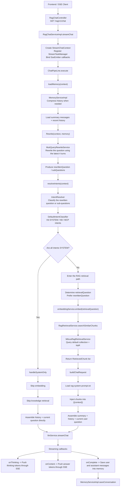

# RagTest

`RagTest` is a multi-module experimental project for building RAG-powered chat, knowledge base management, intent recognition, MCP tool integration, and streaming conversational experiences.

The repository currently focuses on a practical end-to-end loop that combines:

- streaming SSE chat
- conversation memory
- query rewriting
- intent classification
- default knowledge-base retrieval
- LLM response streaming

## Repository Layout

The project is organized around the following modules:

- `rag-bootstrap`
  - Main business module
  - Contains the chat pipeline, knowledge base domain, memory management, intent routing, and HTTP APIs
- `infra`
  - Infrastructure abstractions for LLMs, embeddings, rerank, and model routing
- `framework`
  - Shared conventions, exceptions, web response wrappers, and common infrastructure helpers
- `rag-mcp`
  - Example MCP service integration and tool access
- `rag-web`
  - Frontend pages and interaction demos

## Tech Stack

- Backend: Java 17, Spring Boot, Spring AI
- Data / middleware: Milvus, Redis / Redisson, MyBatis-Plus
- Frontend: React, TypeScript, Vite
- Streaming: SSE-based chat responses

## Retrieval Architecture

The retrieval flow has been documented separately. The architecture document explains:

- the SSE chat entrypoint
- memory loading and compression
- query rewriting
- intent recognition
- `SYSTEM-only` short-circuit logic
- the default knowledge-base retrieval path
- prompt assembly and streaming output

See:

- [RAG Retrieval Architecture](./docs/rag-retrieval-architecture.md)

## Current Retrieval Flow

## Current Frontend UI

## Current Implementation Boundary

The current repository already implements a complete closed loop for:

- memory-aware chat
- query rewriting
- intent recognition
- default knowledge-base retrieval
- streaming answer generation

However, the following parts are not fully connected to the main runtime path yet:

- intent-hit nodes do not yet drive dynamic routing to specific `kbId` or `collectionName`
- `MCP` intent recognition already exists, but actual tool execution has not been plugged into the main chat orchestration

## Current Gaps in Practical Terms

### 1. Intent nodes do not yet route retrieval to concrete knowledge bases

Although the intent tree already supports fields such as:

- `kbId`
- `collectionName`
- `mcpToolId`

the current main retrieval path still uses global defaults inside `MilvusRagRetrievalService`, such as:

- the default `collectionName`
- the default `topK`

In other words, the current implementation does **not** yet retrieve from a specific knowledge base based on the matched intent node. It still queries the default collection.

### 2. MCP intent execution is not yet part of the main chat pipeline

The system can already classify `MCP` intent nodes, but the main `ChatPipeLine` still does not:

- choose a tool by `mcpToolId`
- execute the tool
- inject tool results into the final prompt

So the MCP part is currently better described as:

- intent recognition is ready
- execution orchestration is still pending

### 3. Rerank is available in infrastructure but not enabled in the main path

The `infra` module already contains `RerankService` implementations, but the active RAG path still behaves like this:

`rewrite -> embedding -> Milvus topK retrieval -> prompt assembly -> LLM answer`

instead of:

`rewrite -> embedding -> retrieval -> rerank -> prompt assembly -> LLM answer`

## Recommended Reading

If you want to continue evolving this project, start with:

- [RAG Retrieval Architecture](./docs/rag-retrieval-architecture.md)

Recommended code entry points:

- `rag-bootstrap/src/main/java/org/puregxl/site/rag/controller/RagChatController.java`
- `rag-bootstrap/src/main/java/org/puregxl/site/rag/service/impl/RagChatServiceImpl.java`
- `rag-bootstrap/src/main/java/org/puregxl/site/rag/pipeline/ChatPipeLine.java`
- `rag-bootstrap/src/main/java/org/puregxl/site/rag/service/impl/MemoryServiceImpl.java`
- `rag-bootstrap/src/main/java/org/puregxl/site/rag/core/rewrite/MutiQueryRewriteService.java`
- `rag-bootstrap/src/main/java/org/puregxl/site/rag/core/intent/IntentResolver.java`
- `rag-bootstrap/src/main/java/org/puregxl/site/rag/core/intent/DefaultIntentClassifier.java`
- `rag-bootstrap/src/main/java/org/puregxl/site/rag/retrieval/impl/MilvusRagRetrievalService.java`
- `rag-bootstrap/src/main/resources/prompt/rag-system-prompt.txt`

## Suggested Next Steps

If you want to keep extending the current architecture, the most natural order is:

1. Let intent nodes drive knowledge-base routing
2. Bring MCP intents into the execution pipeline
3. Enable rerank between retrieval and prompt assembly
4. Add multi-intent orchestration for mixed KB / MCP scenarios

## One-Sentence Summary

`RagTest` already has a working loop for conversation memory, query rewriting, intent recognition, default knowledge retrieval, and streaming chat output; the next major step is to make intent hits dynamically route knowledge bases and tools instead of stopping at classification.
