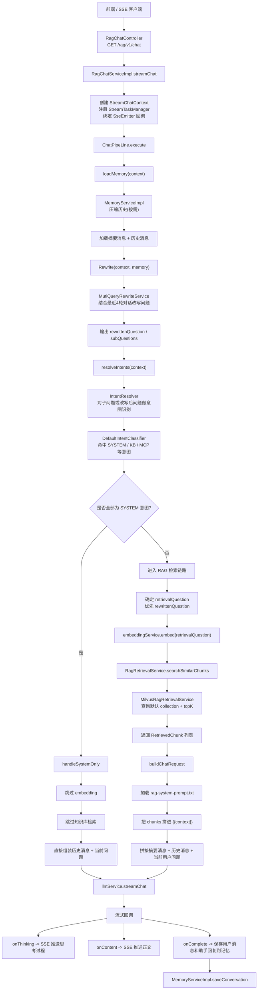

# RagTest 检索全流程架构

本文档描述 `RagTest` 项目中当前已经落地的 RAG 检索主流程，重点说明真实执行路径、关键组件职责，以及当前实现边界，便于后续继续演进意图路由、知识库路由和工具调用链路。

## 1. 总览

当前系统的问答主链路位于 `rag-bootstrap` 模块，整体可以分成以下几个阶段：

1. 接收用户请求并建立 SSE 流式通道
2. 加载会话记忆与摘要上下文
3. 对当前问题做改写和子问题拆分
4. 对问题或子问题做意图识别
5. 判断是否属于纯 `SYSTEM` 意图
6. 如果不是纯 `SYSTEM`，则进入向量检索
7. 组装 RAG Prompt 并调用大模型流式输出
8. 在回答完成后保存会话记忆

## 2. 当前真实执行架构图

## 3. 关键组件职责

### 3.1 控制层与流式入口

- `RagChatController`
  - 对外暴露 `GET /rag/v1/chat`
  - 负责建立 SSE 响应通道
  - 使用幂等切面避免重复请求

- `RagChatServiceImpl`
  - 负责创建 `StreamChatContext`
  - 管理流式任务生命周期
  - 将模型流式输出转换成前端可消费的 SSE 事件

### 3.2 Pipeline 编排层

- `ChatPipeLine`
  - 是当前问答主流程的核心编排器
  - 按固定顺序串联记忆加载、问题改写、意图识别、检索、Prompt 组装和模型调用
  - 已支持对纯 `SYSTEM` 意图问题做短路处理

- `StreamChatContext`
  - 保存本轮请求处理过程中的上下文信息
  - 包括原问题、改写结果、意图结果、历史记忆、任务句柄等

### 3.3 记忆与上下文层

- `MemoryServiceImpl`
  - 按需压缩历史消息
  - 加载摘要消息与历史对话
  - 在问答结束后落库保存本轮消息

当前记忆加载策略不是简单加载完整历史，而是采用“摘要 + 最近历史”的方式控制上下文长度。

### 3.4 改写与意图识别层

- `MutiQueryRewriteService`
  - 根据最近若干轮上下文对当前问题做改写
  - 尝试拆分多个子问题
  - 如果模型输出不合法，则回退为原问题

- `IntentResolver`
  - 负责对改写后的问题或子问题做意图识别
  - 汇总多个问题的识别结果，并做阈值裁剪

- `DefaultIntentClassifier`
  - 基于意图树配置和 Prompt 做意图分类
  - 当前可识别 `SYSTEM`、`KB`、`MCP` 等意图类型

### 3.5 检索层

- `EmbeddingService`
  - 对检索问题生成向量
  - 当前由 `infra` 模块统一做模型路由

- `RagRetrievalService`
  - 定义检索抽象接口

- `MilvusRagRetrievalService`
  - 当前默认实现
  - 使用向量在 Milvus 中进行 TopK 检索
  - 返回 `RetrievedChunk` 列表供后续 Prompt 组装使用

### 3.6 生成层

- `PromptTemplateLoader`
  - 负责加载 `rag-system-prompt.txt`

- `LLMService`
  - 负责调用底层聊天模型
  - 当前支持流式输出，并通过回调把思考内容和回答内容逐步返回给上层

## 4. 当前实现的关键判断分支

### 4.1 纯 SYSTEM 问题

如果当前问题或所有子问题都被识别为 `SYSTEM` 意图，则：

- 不做向量化
- 不做知识库检索
- 不拼接 RAG 系统上下文
- 直接基于“历史记忆 + 当前问题”调用模型

这类问题通常是普通聊天、寒暄、泛化写作或无需知识库支撑的问答。

### 4.2 非纯 SYSTEM 问题

只要识别结果中存在非 `SYSTEM` 的意图，就会进入当前默认 RAG 检索链路：

- 先选择检索问题
- 对检索问题做 embedding
- 查询 Milvus 默认集合
- 将检索结果拼进系统 Prompt
- 调用模型流式生成答案

## 5. 当前实现边界

下面这些能力在系统中已经有“部分实现”或“配置基础”，但还没有完全接入当前主流程：

### 5.1 意图节点还没有真正驱动知识库路由

虽然意图树节点已经支持如下字段：

- `kbId`
- `collectionName`
- `mcpToolId`

但当前主检索链路里，`MilvusRagRetrievalService` 仍然使用的是全局默认配置：

- 默认 `collectionName`
- 默认 `topK`

也就是说，当前不是“按命中的意图节点路由到具体知识库”，而是“统一查默认知识库集合”。

### 5.2 MCP 工具链路尚未进入主问答流程

当前意图识别已经可以识别 `MCP` 类型节点，但 `ChatPipeLine` 还没有在主流程中：

- 根据 `mcpToolId` 选择工具
- 发起工具调用
- 将工具结果注入最终 Prompt

因此 `MCP` 相关能力目前更偏向“识别能力已具备，执行链路待补齐”。

### 5.3 Rerank 尚未启用

`infra` 模块中已经存在 `RerankService` 相关实现，但当前 RAG 主链路中还没有将召回结果做重排序后再送入 Prompt。

当前真实执行逻辑是：

`改写 -> embedding -> Milvus TopK 召回 -> 直接组装 Prompt -> 大模型回答`

而不是：

`改写 -> embedding -> 召回 -> rerank -> Prompt 组装 -> 大模型回答`

## 6. 当前流程的代码落点

如果需要继续排查或演进这条链路，建议优先阅读以下文件：

- `rag-bootstrap/src/main/java/org/puregxl/site/rag/controller/RagChatController.java`
- `rag-bootstrap/src/main/java/org/puregxl/site/rag/service/impl/RagChatServiceImpl.java`
- `rag-bootstrap/src/main/java/org/puregxl/site/rag/pipeline/ChatPipeLine.java`
- `rag-bootstrap/src/main/java/org/puregxl/site/rag/service/impl/MemoryServiceImpl.java`
- `rag-bootstrap/src/main/java/org/puregxl/site/rag/core/rewrite/MutiQueryRewriteService.java`
- `rag-bootstrap/src/main/java/org/puregxl/site/rag/core/intent/IntentResolver.java`
- `rag-bootstrap/src/main/java/org/puregxl/site/rag/core/intent/DefaultIntentClassifier.java`
- `rag-bootstrap/src/main/java/org/puregxl/site/rag/retrieval/impl/MilvusRagRetrievalService.java`
- `rag-bootstrap/src/main/resources/prompt/rag-system-prompt.txt`

## 7. 建议的后续演进方向

如果后续要把当前链路继续完善，比较自然的演进顺序是：

1. 让意图节点驱动知识库路由
   - 根据命中的 `kbId` 或 `collectionName` 选择具体集合

2. 让 `MCP` 意图进入执行链路
   - 根据 `mcpToolId` 发起工具调用
   - 将工具结果纳入最终 Prompt

3. 在召回结果后接入 rerank
   - 提升检索上下文质量

4. 做多意图聚合编排
   - 不同子问题命中不同知识库或工具时，支持分支执行和结果汇总

## 8. 一句话总结

当前 `RagTest` 已经具备“会话记忆 + 问题改写 + 意图识别 + 默认知识库检索 + 流式回答”的完整闭环；但在“按意图动态路由知识库 / 工具”和“召回结果重排序”这两块，还处于结构已铺好、主流程待接入的阶段。
